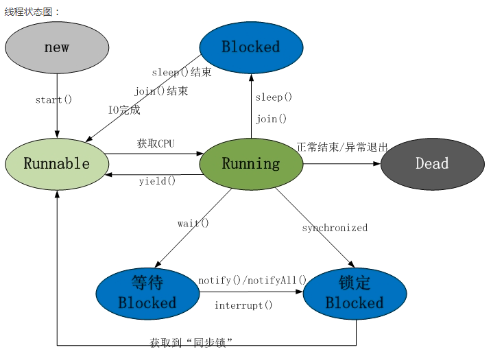

# Java之线程
## 线程和进程
### 进程（Process）
是指在机器内存中运行的应用程序，应用程序启动后系统会分配一块内存空间给这个进程，进程与进程之间是相互独立，即内存不共享。一个进程允许启动N个线程，例如Windows系统中一个后缀是.exe 程序就是一个进程。**进程是系统资源分配的基本单位**。
### 线程（Thread）
是指进程中的某个执行流程，一个进程允许启动 N 个线程，例如java.exe进程中可以运行N个线程。进程和线程的关系是一对多，线程与线程之间共享进程的内存。**线程是调度器（即 CPU）调度的基本单位**。

## 创建线程的方式
- 继承 Thread 类或其子类
- Runnable接口
- Callable 接口
- 线程池方式

## Thread 和 Runnable 的区别
- Thread是使用继承的方式创建线程，Runnable是使用接口的方式创建线程。
- Thread 不适实现合资源共享，Runnable可以被多个线程共享。
- 线程池只能使用Runnable或者Callable接口创建的线程，不能使用Thread创建的线程。

## 线程状态的转换

线程的生命周期中有 5 种状态，如下：
- **新建（New）**：线程对象被创建后（比如 new Thread()）线程进入 New 状态。
- **就绪（Runnable）**：线程启动后（比如 new MyThread().start()）线程进入 Runnable 状态，随时被 CPU 调度执行任务。
- **运行（Running）**：线程得到 CPU 使用权后进入 Running 状态执行任务，线程只能从 Runnable 状态进入到 Running 状态，不可能从其他状态进入到 Running 状态。
- **阻塞（Blocked）**：线程放弃 CPU 使用权后进入 Blocked 状态任务被暂停，直到线程被唤醒进入 Runnable 状态后，才能被 CPU 随机调度。
- **死亡（Dead）**：线程执行任务完毕后或者出现异常，则进入 Dead 状态。

导致阻塞的情况有 3 种：
- **等待阻塞**，比如调用了 wait() 方法，会让当前线程进入等待池，调用 notify() 或者 notifyAll() 可以唤醒进入 Runnable 状态。
- **同步阻塞**，比如线程在获取 Lock 同步锁、或者 synchronized 同步锁失败（假如获取的锁刚好被其它线程所占用着），会让当前线程进入同步阻塞状态。
- **其他阻塞**，比如调用了 sleep() 或 join() 或 yield() 等方法，会让当前线程进入阻塞状态。

### 线程休眠 Thread.sleep()
线程休眠是让出CPU使用权最简便的用法，当休眠指定时间后会自动苏醒，进入Runnable状态等待被CPU调度执行任务，线程之间的执行顺序是无序的。

### 线程让步 Thread.yield()
暂停当前正在执行的线程，让出CPU使用权执行其他线程，达到让步的效果，调用yield()后，并不是让当前线程进入被Blocked状态，而是进入Runnable状态，所以不能确保达到让步的目的，因为让步的线程还有可能被 CPU 调度器再次选中执行。

### 线程合并 join()
线程的合并就是把N个正在并行执行任务的线程合并为一个单线程方式执行，类似锁的效果，比如当线程A必须等待线程B执行完毕才能执行的应用场景就可以使用join()。在多线程场景下可以使用CountDownLatch来控制线程等待。

### 线程的交互 wait()、notify()、notifyAll()
- wait()可以让线程放弃CPU使用权进入等待阻塞状态
- notify()/notifyAll()可以唤醒一个或全部线程，唤醒的线程进入Runnable状态，执行哪个线程就得看CPU的调度了
- wait()、notify()必须配合Synchronized关键字一起使用不灵活、可读性也不好，所以一般都是使用Lock进行锁粒度上的控制

### sleep()和wait()的区别
- sleep()是睡眠的意思，睡眠指定时间后退出阻塞，而wait()是等待的意思，如果不指定等待的超时时间，或者不唤醒则会一直等待阻塞。
- sleep()不会释放锁，睡眠指定时间后可以继续持有这把锁，而wait()会释放锁，被唤醒后进入Runnable（就绪状态），获取CPU使用权后才能持有锁。
- sleep()是Thread对象的方法，而wait()是Object基类的方法。
- sleep()不需配合Synchronized关键字一起使用，而wait()必须配合 Synchronized使用。

### 线程离开运行状态（Running）的方式
1. sleep()线程进入睡眠状态；
2. yield() 暂停线程，尽可能实现让步效果；
3. wait() 暂停线程，等待其他线程执行完毕在继续执行； 
4. 程进入等待阻塞状态；
5. run() 执行完毕；
6. 线程A试图获取线程B的锁资源，而线程B处于未释放锁状态。

## 线程死锁
如果线程A持有锁1并且想获得锁2，线程B持有锁2并且想获得锁1，那么这两个线程就一直等待谁也不释放各自的锁，这种情况就产生死锁了。

实例代码：package com.thread.lock.ThreadLock

## 如何避免死锁
- 避免嵌套锁，ThreadLock就是一个嵌套锁；
- 避免无限期等待，可以设定等待的最大时间来避免，比如：wait(long timeout)、tryLock(long time, TimeUnit unit)；
- 只锁线程共享的部分，尽可能缩小范围，可以一定程度避免死锁，一般是Lock而不使用Synchronized，因为Lock相对比较灵活，锁粒度也小。

## 如何排查死锁
- 使用jps命令查看死锁的进程号
    ```
    jps -l
    ```
- 使用jstack命令打印Java堆栈信息，从堆栈信息中很容易就可以发现产生死锁的位置
    ```
    jstack PID(进程号)
    ```

线程区分**用户线程**和**守护线程**，默认启动的是用户线程，可以通过Thread.setDaemon(true)设置为守护线程，守护线程依赖用户线程，如果用户线程退出了，则守护线程也随着退出。

线程的执行顺序和执行耗时都无法保证，但可以通过设置优先级来提高被执行的概率，但不能确保高优先级就优先执行。

调用notify()和notifyAll() 并不代表唤醒的线程马上被执行，只是从Blocked状态改为Runnable状态，获取CPU使用权后才能被执行。

在单核CPU机器上，每次操作只能运行一个线程，运行哪个线程由JVM线程调度器来调度

## 线程池
线程池其实就是存放着多个线程对象的一个池子，统一管理线程的创建和销毁，类似于数据库连接池。使用线程池的目的很简单，就是尽可能减少系统开销，提高系统性能。

### 使用线程池的好处
- **降低系统开销**，创建线程会消耗一定的CPU和内存，销毁线程也会消耗CPU，我们可以提前创建一些线程放在线程里，需要使用线程时从池里拿来即用，用完就扔回池里，达到重复利用的效果，如此就可以降低一定的系统开销。
- **提高程序效率**，比如我们的某个功能代码中需要用到线程，直接从池里拿线程，省掉了创建线程花费的时间，如此就可以加快程序的响应速度。
- **便于管理线程**，如果线程创建太多会拖垮我们的系统，需要根据具体情况来创建线程，不能太多，也不能太少，线程池可以限制最大线程数，也可以灵活的配置相关参数来实现充分的利用多核CPU的计算能力，还提供了相关便于监控的 API。

### 不使用线程池的坏处
- 如果每次需要用到线程的时候马上创建一个，用完马上销毁，频繁的创建和销毁不但会消耗CPU和内存，还会导致频繁的GC操作，使用线程池就不用担心这些问题了。
- 如果没有使用线程池的核心线程数(即最小数量)和最大线程数来限制创建线程的数量情况下，当创建过多线程时，线程之间的交互和切换会消耗 CPU；当创建过少线程时，又不能充分利用多核 CPU。
- 缺乏更多好用的功能，比如线程中断、定时执行和延时多长时间后再定时执行等等。

### 创建线程池的方式
- Executors
    - newSingleThreadExecutor
    - newFixedThreadPool
    - newCachedThreadPool
    - newScheduleThreadPool
- ThreadPoolExecutor
- ThreadPoolTaskExecutor